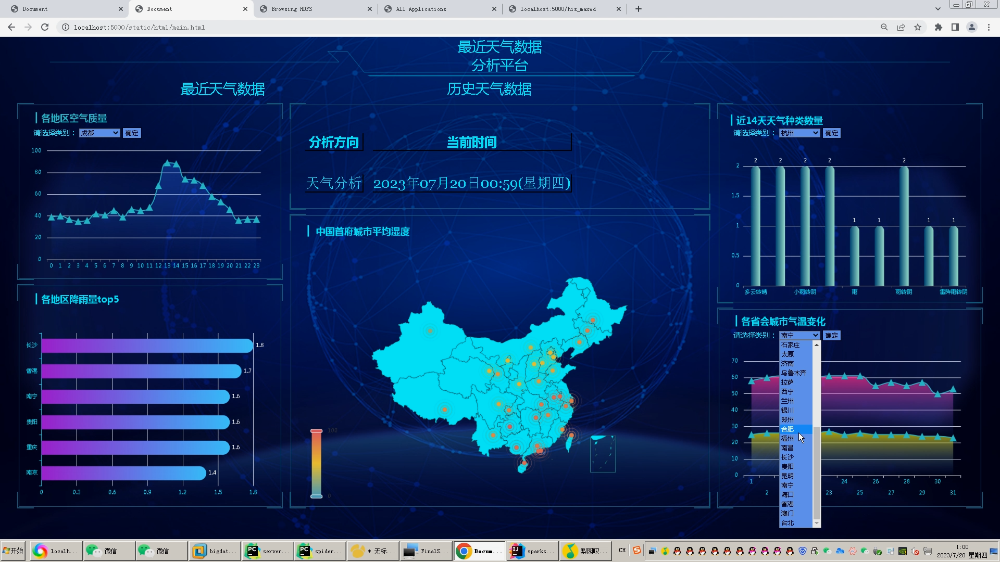
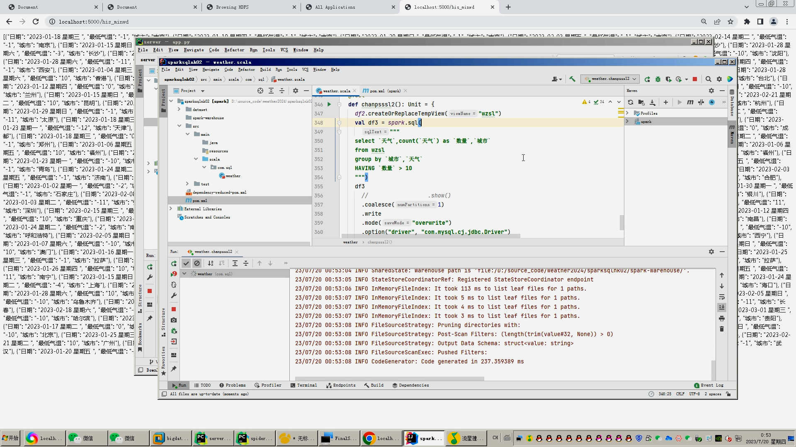

## 计算机毕业设计hadoop+spark天气预测 天气可视化 天气大数据 空气质量检测 空气质量分析 气象大数据 气象分析 大数据毕业设计 大数据毕设

## 要求
### 源码有偿！一套(论文 PPT 源码+sql脚本+教程)

### 
### 加好友前帮忙start一下，并备注github有偿虚拟机天气25
### 我的QQ号是2827724252或者798059319或者 1679232425或者微信:bysj2023nb 或bysj1688

# 

### 加qq好友说明（被部分 网友整得心力交瘁）：
    1.加好友务必按照格式备注
    2.避免浪费各自的时间！
    3.当“客服”不容易，repo 主是体面人，不爆粗，性格好，文明人。

## 功能
依托 Hadoop 大数据平台，基于 Hive 数据仓库对不同城市不同时间的气象数据进行分析。在可视化平台上对分析结果进行可视化展示。首先运用
Python 技术爬取气象网站得到气象数据，爬取的数据存储通过 sqoop 或者 hdfs 命令将本地文件传输至 HDFS 文件系统。基于 Hive 数据仓库和
HiveSQL工具对数据进行分析。运用 Sqoop 数据迁移工具，将分析完成的数据迁移至
MySQL 数据库。最后，以各种技术构建可视化平台，将分析结果以可视化的形式进行展示。大概27000条数据

## 演示视频

https://www.bilibili.com/video/BV14u411V7ZY

https://www.bilibili.com/video/BV16XxCe2EKL/

## 演示截图

